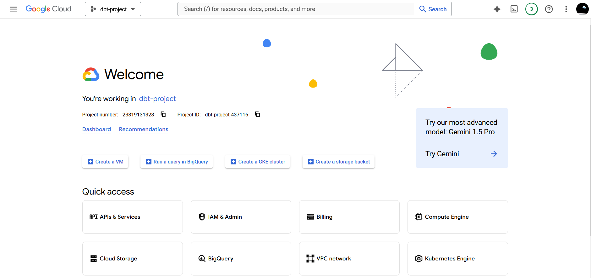
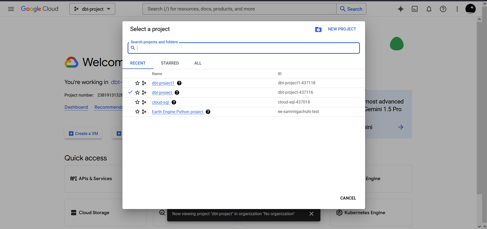
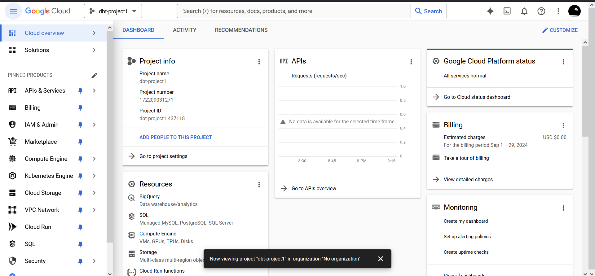
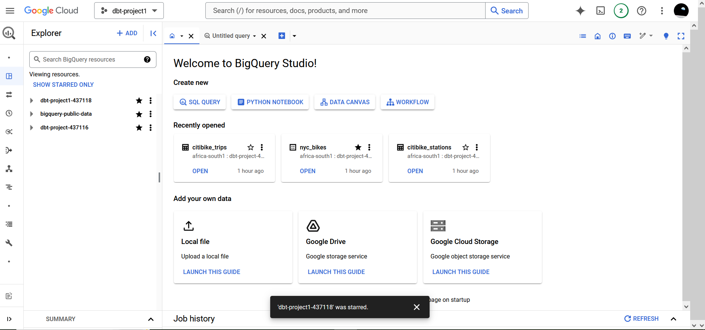
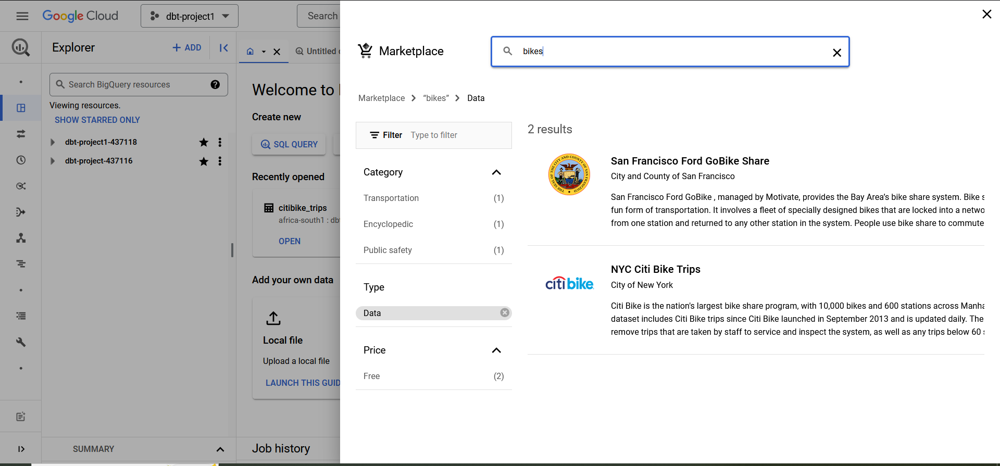
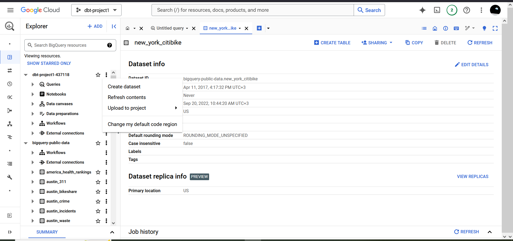
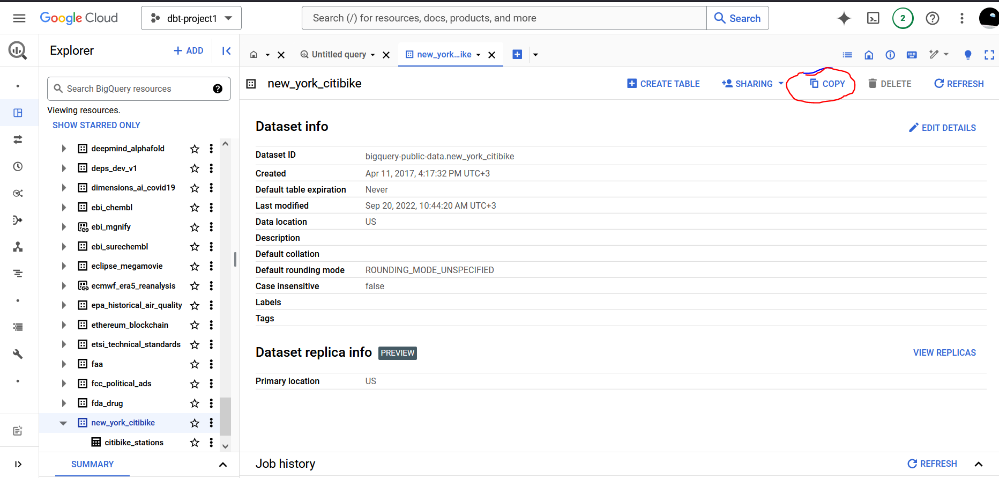
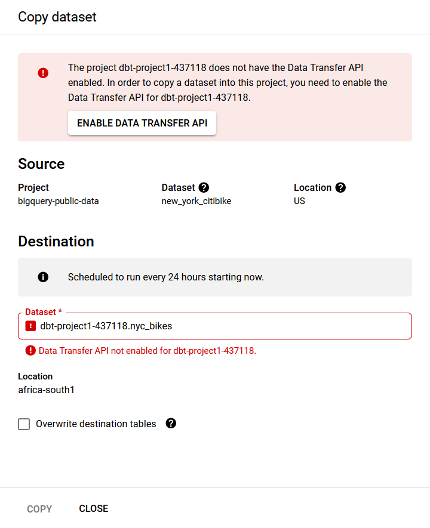
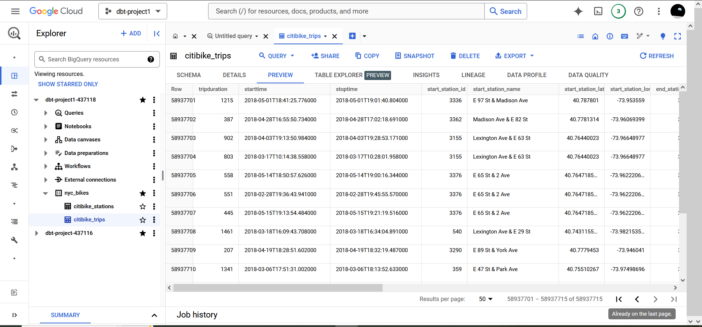

# Our data in BigQuery

In an earlier chapter, we saw that in data engineering data mainly goes through three processes: extract, load and transform (ELT). The Extract, Transform, Load (ELT) is more of a traditional approach and we will not use it in this case. We will be using Google Bigquery as our data warehouse when working with dbt.

As a reminder, let's go through the definitions of ELT.

Extract - the process of identifying and reading data from one or more source systems. We won't have to do this since the New York City (NYC) bikes data that will be using has already been *extracted* from its source by BigQuery creators. 

Load - the process of adding the extracted data to the data warehouse, --in this case Google BigQuery. Again, Google has done this for us. Therefore we won't have to do it. 

Transform - the process of converting data from its raw format to the format that it will be used for analysis. This falls definitely within our forte. And we shall use dbt for this. Examples of data transformations that can be done with SQL modeling in dbt are:

* Replacing codes with values
* Aggregating numerical sums
* Applying mathematical functions (SQL can do some maths too, but can be very verbose here)
* Converting data types
* Modifying text strings
* Combining data from different tables and databases.

## Accessing Big Query

BigQuery is a data warehouse provided by Google. 

To access it, open an incognito window and go to this [link](https://cloud.google.com/). Sign in using your gmail account. 

Click on **Console** button at the top right. That step of bravery will take you to an interface that looks like this:

Click on the dropdown at the top. Select **NEW PROJECT**. We want to create a new project that will contain some tables that we will work with in dbt.

Name your project as `dbt-project1` or any other name you prefer. Then select **CREATE**. 

Once the project has been created, you will be returned to the original page as at first. However, when you select the project dropdown again, you should see your newly created project as one of the options.

Click on your project, the interface will refresh and the dropdown should now reflect `dbt-project1`.

Click on the **Dashboard** link on the homepage. 

The below interface should appear. It can seem overwhelming at first. Lots of things in one place.

In one of the "boxes" within the **Dashboard** tab, you will find one called **Resources** with the **BigQuery** button underneath. Click on this button. It will take you to a page asking you to *Enable the BigQuery Application Programming Interface (API)*. Do comply!

Behold, below is the BigQuery interface.

 

You will see one of the resources as `dbt_project1<some-random-number>` in case you had other resources. Star this project for quick access in future.

## Copying the New York City Bikes data

One of the datasets we will be working with is the "New York City Bikes dataset". To access it, click on the **ADD** button. A sidebar will open up. Go to **Public Datasets**.

In the **Search Marketplace** searchbar, type 'bikes'. 

Click on the NYC Citi Bike Trips tab. A new sidebar will popup with a button of **View Dataset**. Click this button and the Google Cloud Platform (GCP) Dashboard will reappear but this time round the `bigquery-public-data` resource will appear.

Click on this particular resource's dropdown on the left and scroll down to the `new_york_citibike` dataset. We want to copy this dataset from that of `bigquery-public-data` to that of `dbt_project1-437718`. The random numbers will be different in your case.

Scroll up again to your `dbt_project1` resource. On the kebab menu on the right of this resource, select *Create Dataset*. 

A new sidebar will open. Insert the following for each parameter:

* Dataset ID - `nyc_bikes`

* Location type - `Region`

* Region - `africa-south1 (Johannesburg)` or your preferred region

Thereafter, click on **CREATE DATASET**. 

The `nyc_bikes` dataset should now appear under the `dbt-project1` resource. We want to copy the contents of the `new_york_citibike` dataset into our `nyc_bikes` dataset. So how do we proceed?

Scroll down to the `new_york_citibike` dataset under the `bigquery-public-data` resource and click on it. On the menu for this dataset, you will see the **Copy** button. Click on this button. 

In the **Destination** searchbar, type `nyc_bikes` in reference to where we want to copy the contents into. You may need to enable the data transfer API to perform the copy operation. Do so if BigQuery necessitates that *it* must be enabled.

Once you copy the dataset, a small bar will appear on the screen saying **View Details**. Click on it to stop the run operation since BigQuery will be rerunning the copy operation after every 24 hours. Disable the transfer process and delete it. 

Going back to your `dbt_project1` resource, your `nyc_bikes` dataset should now be having two tables under it. That is:

* citibike_stations
* citibike_trips

Click on any of the tables and preview the data therein using the **PREVIEW** button of each tables' interface. 

Congratulations on loading your first table in BigQuery!

