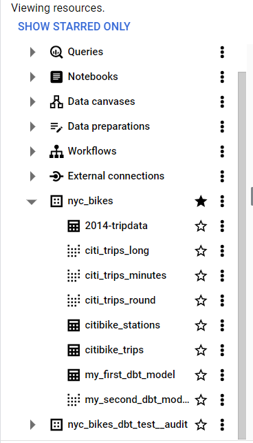
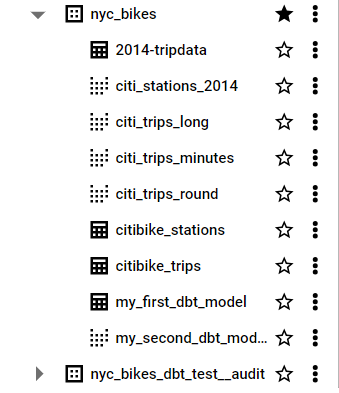
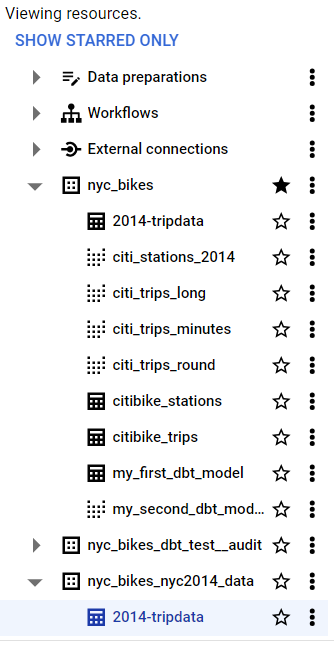
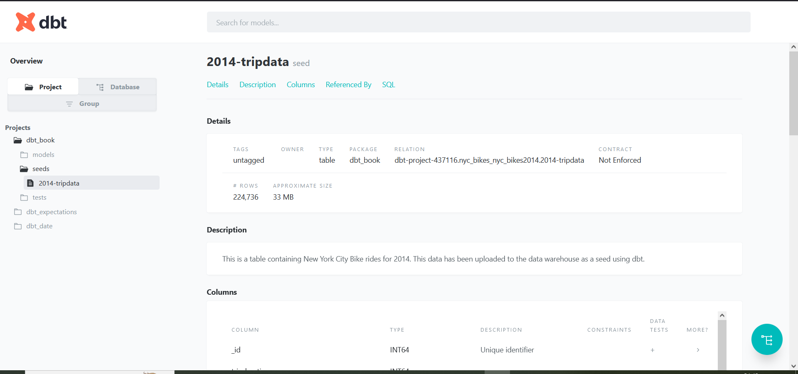

# Seeds

Seeds are Comma Separated Values (csv) files stored inside your `seeds` directory which can be loaded into your data warehouse using the `dbt seed` command. 

Seeds can also be referenced by your SQL models using the `ref()` function. Seeds in dbt are version controlled. That is, you can revert them to a previous state. 

Seeds are best used for data that changes infrequently. A good example is country codes, email accounts and station names. However, seeds should not be used to store sensitive information such as passwords.

To demonstrate about seeds in dbt, we will try to upload a [New York City (NYC) bike history data](https://www.civicdata.com/dataset/nyc-bike-share-trip-data/resource/3e7acf34-19ba-4bf4-8dd2-cf349623dc6b) for 2014.

Extract the zip folder and copy the `3e7acf34-19ba-4bf4-8dd2-cf349623dc6b.csv` inside the `dbt_book/seeds` directory. To reduce the verbosity of its name, rename it to `2014-tripdata.csv`. 

## Uploading a seed into your data warehouse

Believe you me we had a better csv table to upload, one much more related to the NYC bikes dataset. However, because it was ~320MB and we want to be economical in the upload time and bandwith, we settled for this historical data. Nevertheless, keeping on with this chapter, to upload a seed into a data warehouse, we use this command:

```
dbt seed
```

After that, it's a test of patience. Depending on your upload speeds, it shouldn't take long to upload a 36MB file to BigQuery.

```
-- snip --
16:31:51  Concurrency: 1 threads (target='dev')
16:31:51  
16:31:51  1 of 1 START seed file nyc_bikes.2014-tripdata ................................. [RUN]
16:33:17  1 of 1 OK loaded seed file nyc_bikes.2014-tripdata ............................. [INSERT 224736 in 85.39s]
16:33:17  
16:33:17  Finished running 1 seed in 0 hours 1 minutes and 28.54 seconds (88.54s).
16:33:17  
16:33:17  Completed successfully
16:33:17  
16:33:17  Done. PASS=1 WARN=0 ERROR=0 SKIP=0 TOTAL=1

```

If you go to BigQuery and refresh the contents of your `nyc_bikes` dataset, you should see the `2014-tripdata` table present.




## Referencing seeds in models

Just like you would reference a model in another model, we can also reference seeds in another model. All you need to reference a seed is to place the name of the csv file, excluding the `.csv` extension inside the `ref()` function. 

For example, we want to create a view that contains those start station names from our 2014 table that are existent in the `citi_trips_long` model.

Within the `models/my_models` directory, create the `citi_stations_2014.sql` model with the following query:

```
{{ config(materialized='view') }}

WITH citi_stations_2014 AS (
    SELECT * FROM {{ref ('2014-tripdata') }}
    WHERE `start station name` IN (
        SELECT start_station_name FROM {{ ref('citi_trips_long') }}
    )
)

SELECT * FROM citi_stations_2014

```

Thereafter, run the model using `dbt run --select citi_stations_2014`

That will create a view that contains only those stations within the `2014-tripdata.csv` also within the `citi_trips_long` model. Much to our surprise, all the stations within our 2014 table are also found in the `citi_trips_long` model! 

Here are the SQL queries we used to perform a count of each of the two tables in BigQuery.

```
SELECT COUNT(*) FROM `dbt-project-437116`.`nyc_bikes`.`2014-tripdata`;

SELECT COUNT(*) FROM dbt-project-437116.nyc_bikes.citi_stations_2014;
```

Both returned a value of `224736`.

Here is the view of the `citi_stations_2014` model in BigQuery.



## Seed Configurations at project level

Though it may sound like there is a lot to do here, there actually isn't. Suffice to only say that seeds are configurable as much as our normal models are. There are two ways to [configure seeds](https://docs.getdbt.com/reference/seed-configs) in dbt: either in the `dbt_project` YAML file or at the individual seed's YAML properties. 

For the purposes of this exercise, at the project level we will set a dictionary that looks as follows:

```
seeds:
  dbt_book:
    2014-tripdata:
      schema: nyc2014_data
```

For any [custom schema](https://docs.getdbt.com/reference/resource-configs/schema) that we set, the result will be in the following format: `{{ target.schema }}_{{ schema }}.` That means the expected schema for our seed will be `nyc_bikes_nyc2014_data` --quite a mouthful of a name.

Thereafter run `dbt seed`.

```
-- snip --
19:24:43  Concurrency: 1 threads (target='dev')
19:24:43  
19:24:43  1 of 1 START seed file nyc_bikes_nyc2014_data.2014-tripdata .................... [RUN]
19:26:18  1 of 1 OK loaded seed file nyc_bikes_nyc2014_data.2014-tripdata ................ [INSERT 224736 in 95.10s]
19:26:18  
19:26:18  Finished running 1 seed in 0 hours 1 minutes and 46.50 seconds (106.50s).
19:26:18  
19:26:18  Completed successfully
19:26:18  
19:26:18  Done. PASS=1 WARN=0 ERROR=0 SKIP=0 TOTAL=1
```

Think of a schema as a folder or container for storing your data (read tables). Therefore, if you were in a company, there would be a schema (read it as folder or container) for sales, customers, products and clients. Inside the schema, (read folder or container) for sales, there would be tables for `january_sales`, `february_sales` and so on. 

Just a *nota bene*, don't use hyphens `(-)` for your schema names, otherwise it will result in an error. 

Here is our seed data appearing under the `nyc_bikes_nyc2014_data` dataset. 



## Seed properties and configurations at properties level

Seeds can also be configured at the properties level. In fact, the configurations at the properties level will override those set at the project level, that is at the `dbt_project` file. 

To demonstrate setting seed configurations at the properties level, create `nyc_bikes2014` YAML file. Copy paste the following contents into the file. 

```
version: 2

seeds:
  - name: 2014-tripdata
    description: "Seed for NYC 2014 bike data"
    docs:
      show: true 
      node_color: purple # Use name (such as node_color: purple) or hex code with quotes (such as node_color: "#cd7f32")
    config:
      schema: nyc_bikes2014
```

Not much different from the model properties' files we create, isn't it? In this case, the `name` of the model is not a SQL file but the csv we pushed to the data warehouse. The `docs` key is not so much important as the `config` key which we use to set the schema of our seed in the data warehouse.

What's good for the goose is good for the gander. Much akin to the model properties files where we can insert tests and documentation, the same goes for seed properties' files. In the contents of the below properties file of `nyc_bikes2014.yml` we have inserted documentation at both the table and column levels. We have also inserted tests at both levels as well. 

```
version: 2

seeds:
  - name: 2014-tripdata
    description: '{{ doc("seed_2014_tripdata") }}'
    docs:
      show: true 
      node_color: purple # Use name (such as node_color: purple) or hex code with quotes (such as node_color: "#cd7f32")
    config:
      schema: nyc_bikes2014
    tests:
      - dbt_expectations.expect_table_column_count_to_be_between:
          min_value: 1 # (Optional)
    columns:
      - name: _id
        description: 'Unique identifier'
        tests:
          - dbt_expectations.expect_column_values_to_be_unique

      - name: tripduration
        description: '{{ doc("tripduration") }}'
```

If you have additional seeds, simply add them to the properties files much like what we have in the `my_models.yml` which consists of the three models `citi_trips_minutes`, `citi_trips_round` and `citi_trips_long`. 


## Performing tests on seeds 

Tests on seeds are performed in much the same way as other models. The only trick is to insert the name of the csv file. For example, to run a test of our `2014-tripdata.csv` which is our seed model, we execute `dbt test --select 2014-tripdata`. 

```
-- snip --
18:19:53  Concurrency: 1 threads (target='dev')
18:19:53  
18:19:53  1 of 2 START test dbt_expectations_expect_column_values_to_be_unique_2014-tripdata__id  [RUN]
18:19:57  1 of 2 PASS dbt_expectations_expect_column_values_to_be_unique_2014-tripdata__id  [PASS in 4.67s]
18:19:57  2 of 2 START test dbt_expectations_expect_table_column_count_to_be_between_2014-tripdata_1  [RUN]
18:20:02  2 of 2 PASS dbt_expectations_expect_table_column_count_to_be_between_2014-tripdata_1  [PASS in 4.58s]
18:20:02  
18:20:02  Finished running 2 data tests in 0 hours 0 minutes and 12.62 seconds (12.62s).
18:20:02  
18:20:02  Completed successfully
-- snip --
```

As you can see, the two tests of `dbt_expectations.expect_table_column_count_to_be_between` and `dbt_expectations.expect_column_values_to_be_unique` passed. 

## Viewing documentation for dbt seeds

Even much less different than running tests is the generation of documentation regarding your dbt seeds. The process is exactly the same. First, run `dbt docs generate`. Assuming that the manifest files have successfully been created in the catalog, run `dbt docs serve`. If no errors appear at this final stage, open the port link that appears, such as `localhost:8080/`, on the terminal in your preferred browser. 

You should see the documentation you created for your seed. The lineage graph should also work well for the seeds too.




Every seed at some point is left to grow on its own. We suppose this chapter has provided the necessary nutrition to see you bud to life working with dbt seeds!


