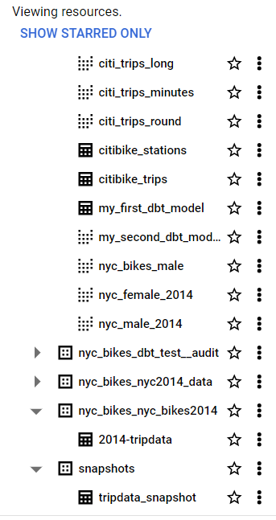
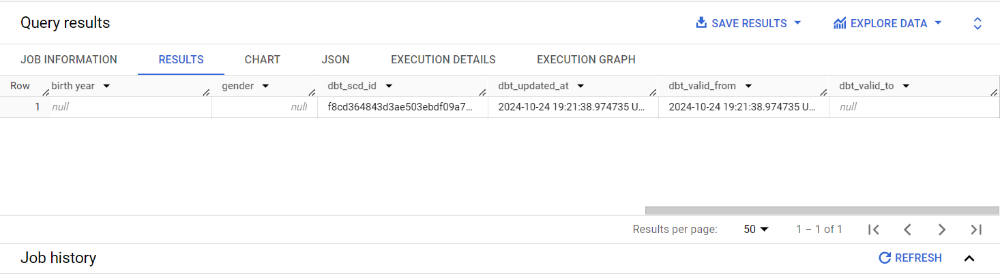
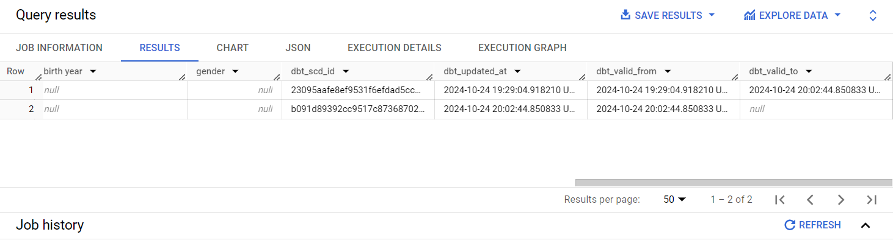
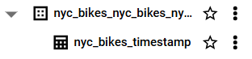
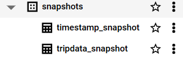
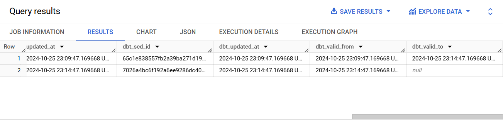

# Snapshots

Picture this, there is this lady you have falled head over heels for. After turning and tossing for several nights, you decide to visit her at her preferred rendezvous because she is currently not anywhere interested in being taken out. When you meet her, you decide to ask her to take a 'selfie' of both of you side by side. You think she will send the selfie to you, but she never does. Well, that's a true story of yours truly and even though no hard feelings over the incident, snapshots in dbt work in much the same way. 

A snapshot in dbt is a recorded change of a mutable table. Think of a snapshot as a way to track changes in your data. For example, you could be having a crazy table that logs your relationship status with your girlfriend or boyfriend over time. The first row could be as follows:

```
|----------|--------------|---------------|
| id       |  Status      | updated-at    |
| 11       |  Spark       | 21/09/2024    |
|----------|--------------|---------------|
```

Now, let's say you realise something about your girlfriend and boyfriend that puts a freeze on the relationship. So in your relationship table it would have the following update:

```
|----------|--------------|---------------|
| id       |  Status      | updated-at    |
| 11       |  Shaky       | 22/10/2024    |
|----------|--------------|---------------|
```

Our above update will have overwritten the previous record of 'Spark' when the relationship was at cloud nine. dbt offers a way to preserve these past records so that they can be used for further analysis, and also for posterity purposes. For example, keeping a record of the change can be used to analyse how long the relationship lasted from its hey days to when the waves started beating the ship. This kind of analysis can be used for more serious matters, such as when analyzing the time it takes from sending to receiving an order. dbt will help you record these changes and log the time when the change took place. For example, our dbt snapshot for our relationship would be:


|----------|--------------|---------------|----------------|--------------|
| id       |  Status      | updated-at    | dbt_valid_from | dbt_valid_to |
| 11       |  Spark       | 21/09/2024    | 21/09/2024     | 22/10/2024   |
| 11       |  Shaky       | 22/10/2024    | 22/10/2024     | null         |
|----------|--------------|---------------|----------------|--------------|


The most up-to-date record will have a value of `null` in the `dbt_valid_to` field. Here is a description of the last two fields and others internally used by dbt. 

1. `dbt_valid_from` - The timestamp when this snapshot row was first inserted. This column can be used to order the different "versions" of a record. 

2. `dbt_valid_to` - The timestamp when this row became invalidated. The most recent snapshot record will have `dbt_valid_to` set to null.

3. `dbt_scd_id` - 	A unique key generated for each tracked record. This is used internally by dbt.

4. `dbt_updated_at` - The updated_at timestamp of the source record when this snapshot row was inserted. This is internally used by dbt.

Slowly Changing Dimension (SCD) refers to the way data changes over time in a data warehouse. In today's world, one wouldn't say that data changes slowly, but the term arises from the fact that even though data may change infrequently, such as makeups and breakups in your relationship, they are significant over time even to the future of the relationship or the continuity of your business!

SCDs are typically of three types:

* **Type 1**: This is where old data is overwritten without any preservation of its history. Old data ceases to exist with update of new data.

* **Type 2**: When a new record of data is added, the old record is preserved as historical data. This is the most common type of SCD and which dbt implements. 

* **Type 3**: This approach adds a new column for the new data and preserves the old data in the original column. This type is best used to see the progression of changes *rather* than when a change happened. 

Therefore, when *snapshoting* in dbt, when a change occurs in the source data, instead of overwriting the existing record (Type 1) or a dding a new column (Type 3), dbt adds a new record with the new data (Type 2). The `dbt_valid_from` and `dbt_valid_to` columns in the snapshot table indicate when each version of the record was valid, allowing you to track the full history of changes over time. This looks much like git commits, only that the commits are in tabular form.

## Create a snapshot

Creating a snapshot in dbt to some extent depends on the version you are using. Starting from version 1.9, you will actually need two files to perform a dbt snapshot. These are the YAML and sql files. However, this tutorial was written using version 1.8.7. To know the dbt version you are using, type `dbt debug`. You will see your version listed like so:

```
--snip--
19:41:25  Running with dbt=1.8.7
19:41:25  dbt version: 1.8.7
19:41:25  python version: 3.10.12
--snip--
```

Now to create a snapshot using dbt versions lower than for 1.9, you will create a snapshot SQL file with the following configurations.

```


{{
  config(      
    target_schema='snapshots',      
    strategy='check',      
    unique_key='_id',      
    check_cols='all'    
  )  
}}  

SELECT * FROM {{ source('nyc_bikes_nyc_bikes2014', '2014-tripdata') }}


```

Let's go through it line by line. The macros `` and `` indicate that this is a snapshot file. Your configurations will go inside the `config()` function. 

`target_schema` - this is the schema in which your snapshot will be stored. 

`strategy` - this is the mechanism by which dbt will know that a row has changed. The `timestamp` strategy, and the most recommended for that matter, uses an `updated_at` column to determine if a row has changed. On the other hand, the `check` strategy compares a list of columns between their current and historical state to determine what has changed. Use the `check` strategy if there is no reliable `updated_at` column for tracking changes with time, as in our case.

`unique_key` - this is the unique key in your table that dbt will use.

`check_cols` - These are the columns to check for changes. The `all` parameter can be passed in case you want to track changes in all the columns of the row. 

One can also add an additional `invalidate_hard_deletes` [configuration](https://docs.getdbt.com/docs/build/snapshots) to track rows that have been deleted. The `dbt_valid_to` column of deleted rows will be set to the current snapshot time.

Finally, the `SELECT` statement. You will insert inside the `source()` function the table in which you would like to track changes. 

Thereafter, run `dbt snapshot`. Below is the output. 

```
21:01:01  Concurrency: 1 threads (target='dev')
21:01:01  
21:01:01  1 of 1 START snapshot snapshots.tripdata_snapshot .............................. [RUN]
21:01:11  1 of 1 OK snapshotted snapshots.tripdata_snapshot .............................. [CREATE TABLE (224.7k rows, 33.3 MiB processed) in 10.03s]
21:01:11  
21:01:11  Finished running 1 snapshot in 0 hours 0 minutes and 17.65 seconds (17.65s).
21:01:12  
21:01:12  Completed successfully
21:01:12  
21:01:12  Done. PASS=1 WARN=0 ERROR=0 SKIP=0 TOTAL=1
```

A new table should appear under the `snapshots` schema in BigQuery. 



When you run `dbt snapshot` the first time, the `dbt_valid_to` column will be `null` for all records. Thereafter, when you run subsequent `dbt snapshot` executions for a table that has undergone a change, the `dbt_valid_to` will be populated with a timestamp value in the `dbt_valid_to` of the altered row. 

## The `check` strategy 

Now is the time to truly test if our snapshots work. Go to the SQL tab of your Big Query and insert a new row using this query:

```
INSERT INTO `dbt-project-437116`.`nyc_bikes_nyc_bikes2014`.`2014-tripdata` (`_id`, `tripduration`, `start station name`) 
VALUES (000000, 1000, 'Nowhere Near Station');
```

Thereafter run `dbt snapshot`. 

Ensure that the new row has been added by crosschecking its existence via:

```
SELECT * FROM `dbt-project-437116`.`nyc_bikes_nyc_bikes2014`.`2014-tripdata`
WHERE `start station name` = 'Nowhere Near Station';
```

Now check if our `tripdata_snapshot` table has captured the new row using the below query.

```
SELECT * FROM `dbt-project-437116`.`snapshots`.`tripdata_snapshot`
WHERE `start station name` = 'Nowhere Near Station';
```

Its a new row of data, which means all columns have been affected with a new value in each. Remember we set the `check_cols=all`. 



Let's go on.

Insert a new row, with an additional extra change in the `_id` column.

```
UPDATE `dbt-project-437116`.`nyc_bikes_nyc_bikes2014`.`2014-tripdata`
SET `start station name` = 'Even Further Station', `_id` = 1001995
WHERE `_id` = 0;
```

Again, run `dbt snapshot`. Always run `dbt snapshot` when your data has received new data update. 

Let's check if the new row with two updates has been recorded in our snapshots table.

```
SELECT * FROM `dbt-project-437116`.`snapshots`.`tripdata_snapshot`
WHERE `start station name` = 'Even Further Station';
```

If you run this, you will notice that the `dbt_valid_to` is still `null`. This could possibly be because we have added a new unique key and thus dbt will still treat this as a new record rather than one which was changed from 0 to 1001995.


Now, update the row with `_id` 1001995 using the below SQL query.

```
UPDATE `dbt-project-437116`.`nyc_bikes_nyc_bikes2014`.`2014-tripdata`
SET `start station name` = 'Furth East Station'
WHERE `_id` = 1001995;
```

Now after running `dbt snapshot` , let's see if our snapshot table will have tracked the historical change of `Even Further Station` and `Furth East Station` of row `_id` 1001995. Use the below query to unravel the results.

```
SELECT * FROM `dbt-project-437116`.`snapshots`.`tripdata_snapshot`
WHERE `_id` = 1001995;
```




Yes it did! For row 1, which stands for when the 'start station name' was `Even Further Station`, we can see that row was valid from 2024-10-24 19:29 to 2024-10-24 20:02. However, the new row 2, which is where the 'start station name' was switched to `Furth East Station`, we can see it became valid from 2024-10-24 20:02; the exact time when row was updated. 

You can indeed check if the latest change is in the `2014-tripdata` table via:

```
SELECT * FROM `dbt-project-437116`.`nyc_bikes_nyc_bikes2014`.`2014-tripdata`
WHERE `start station name` = 'Furth East Station';
```

## The `timestamp` strategy

The `timestamp` strategy in snapshoting relies on an `updated_at` column to check if any changes have occurred on the row. If the configured `updated_at` column is more recent than when the table was last run, dbt will invalidate the old record and record a new one. If the timestamps are unchanged, dbt will not take any action.

The `timestamp` strategy requires an `updated_at` column which represents when the row was last updated. In order to work with `timestamp` strategy, we need to recreate our `2014-tripdata` but now with an additional `updated_at` column. It can be any table, so long as there is an `updated_at` column, but we settled on this one because it is lightweight. Plus, we already have it as a seed. We will use a dbt model to recreated the `2014-tripdata` seed but with an extra `updated_at` column.

Create a `nyc_bikes_timestamp` SQL model inside the `sources` folder. Copy paste the following contents into the model.

```
{{ config(
    materialized="table",
    schema="nyc_bikes_nyc_bikes2014"
) }}

WITH nyc_bikes_timestamp AS (
  SELECT *, CURRENT_TIMESTAMP() AS updated_at FROM {{ source('nyc_bikes_nyc_bikes2014', '2014-tripdata') }}
)

SELECT
  *
FROM nyc_bikes_timestamp
```




We are configuring it as a table because for some reason, when trying to update fields into this model using BigQuery, an error came up simply because it was a view!

Now run `dbt run --select sources`. You will get the below output.

```
19:08:14  Concurrency: 1 threads (target='dev')
19:08:14  
19:08:14  1 of 4 START sql view model nyc_bikes.nyc_bikes_male ........................... [RUN]
19:08:16  1 of 4 OK created sql view model nyc_bikes.nyc_bikes_male ...................... [CREATE VIEW (0 processed) in 2.45s]
19:08:16  2 of 4 START sql table model nyc_bikes_nyc_bikes_nyc_bikes2014.nyc_bikes_timestamp  [RUN]
19:08:22  2 of 4 OK created sql table model nyc_bikes_nyc_bikes_nyc_bikes2014.nyc_bikes_timestamp  [CREATE TABLE (224.7k rows, 33.3 MiB processed) in 5.31s]
19:08:22  3 of 4 START sql view model nyc_bikes.nyc_female_2014 .......................... [RUN]
19:08:24  3 of 4 OK created sql view model nyc_bikes.nyc_female_2014 ..................... [CREATE VIEW (0 processed) in 2.22s]
19:08:24  4 of 4 START sql view model nyc_bikes.nyc_male_2014 ............................ [RUN]
19:08:26  4 of 4 OK created sql view model nyc_bikes.nyc_male_2014 ....................... [CREATE VIEW (0 processed) in 2.39s]
19:08:26  
19:08:26  Finished running 3 view models, 1 table model in 0 hours 0 minutes and 29.78 seconds (29.78s).
19:08:26  
19:08:26  Completed successfully
19:08:26  
19:08:26  Done. PASS=4 WARN=0 ERROR=0 SKIP=0 TOTAL=4
```

Now that we have already created a table of `nyc_bikes_timestamp`, we would also want to reference it in downstream models. As you read in an earlier chapter, dbt sources are what make models to be referenced in other queries using the `source()` function. Therefore in the `sources/sources_bikes.yml`, add the following:

```
- name: nyc_bikes_nyc_bikes_nyc_bikes2014
        schema: nyc_bikes_nyc_bikes_nyc_bikes2014
        tables:
          - name: nyc_bikes_timestamp
            description: ''
```

Now is the time to create a dbt snapshot relying on the `timestamp` strategy. 

Create a `timestamp_snapshot` in the `snapshots` directory with the following SQL contents.

```


{{
  config(      
    target_schema='snapshots',      
    strategy='timestamp',      
    unique_key='_id',      
    updated_at='updated_at'    
  )  
}}  

SELECT * FROM `dbt-project-437116`.`nyc_bikes_nyc_bikes_nyc_bikes2014`.`nyc_bikes_timestamp`



```

You may wonder why we are not using something like `{{ source("schema", "table") }}` in the SELECT statement. We had initially run that with `nyc_bikes_nyc_bikes_nyc_bikes2014` and `nyc_bikes_timestamp` as the *schema* and *table* names respectively. However, dbt kept throwing an error that it couldn't find such a table therefore we resulted in the unorthodox way of hardcoding the entire dataset-schema-table namespace. 

Now run `dbt snapshot` to create the `nyc_bikes_timestamp` table.

```
19:31:54  Concurrency: 1 threads (target='dev')
19:31:54  
19:31:54  1 of 2 START snapshot snapshots.timestamp_snapshot ............................. [RUN]
19:32:02  1 of 2 OK snapshotted snapshots.timestamp_snapshot ............................. [CREATE TABLE (224.7k rows, 35.0 MiB processed) in 8.10s]
19:32:02  2 of 2 START snapshot snapshots.tripdata_snapshot .............................. [RUN]
19:32:15  2 of 2 OK snapshotted snapshots.tripdata_snapshot .............................. [MERGE (0.0 rows, 44.0 MiB processed) in 12.54s]
19:32:15  
19:32:15  Finished running 2 snapshots in 0 hours 0 minutes and 28.86 seconds (28.86s).
19:32:15  
19:32:15  Completed successfully
19:32:15  
19:32:15  Done. PASS=2 WARN=0 ERROR=0 SKIP=0 TOTAL=2
```




Now to check if our timestamp table can snapshot changes, let's insert a new row and make some changes to it. Paste the following in a SQL tab in BigQuery.

```
INSERT INTO `dbt-project-437116`.`nyc_bikes_nyc_bikes_nyc_bikes2014`.`nyc_bikes_timestamp` (`_id`, `tripduration`, `start station name`, `updated_at`) 
VALUES (21001995, 2000, 'Sumwhere Near Station', '2024-10-25 23:09:47.169668 UTC');
```

Note the `updated_at` column. Unlike when working with the `check` strategy which could still work well with several fields as `null`, omitting the `updated_at` column in the `timestamp` strategy is costly as dbt will be unable to track any change. All you will get is just a new field but with several `null` values in the snapshot table. 

Now run `dbt snapshot` and when it succesfully runs, check `timestamp_snapshot` table using this SELECT statement in BigQuery.

```
SELECT * FROM `dbt-project-437116`.`snapshots`.`timestamp_snapshot` 
WHERE `_id` = 21001995;
```

Now change the station name from 'Sumwhere Here Station` to 'Somewhere Near Station' to demonstrate tracking a change.

```
UPDATE `dbt-project-437116`.`nyc_bikes_nyc_bikes_nyc_bikes2014`.`nyc_bikes_timestamp`
SET `start station name` = 'Somewhere Here Station', `updated_at` = '2024-10-25 23:14:47.169668 UTC'
WHERE `_id` = 21001995;
```

Run `dbt snapshot`.

Now check if dbt has been able to track changes. We expect that the row with the station name 'Sumwhere Near Station' was valid for a short period (see the `dbt_valid_from` and `dbt_valid_to` columns) while the 'Somewhere Here Station' is the most current.

```
SELECT * FROM `dbt-project-437116`.`snapshots`.`timestamp_snapshot` 
WHERE `_id` = 21001995;
```

You should see we've been able to track changes. 




The downside of using the `timestamp` strategy is that you have to use the `updated_at` column or whatever timestamp column you defined. Nevertheless, based on our exercise so far, the `check` strategy is far much better and less taxing.


