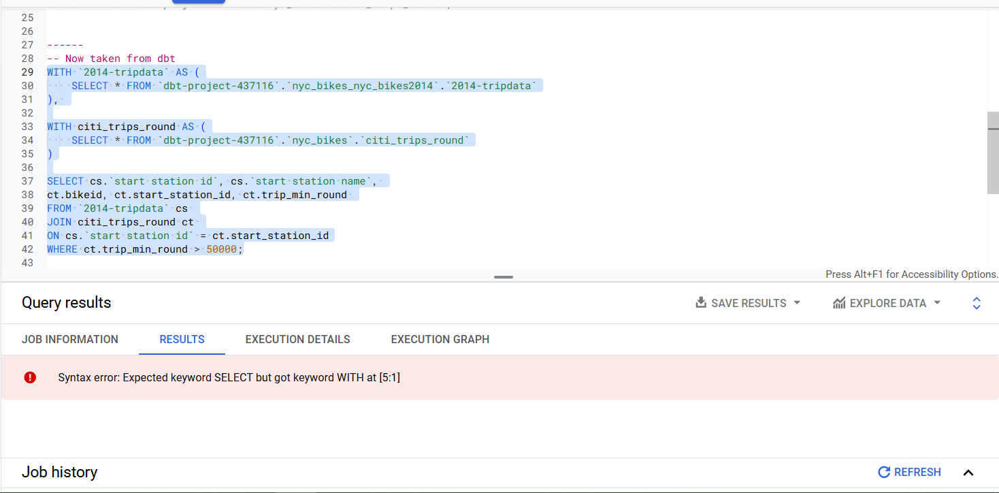

# Analyses 

In dbt, analyses are those kind of queries that might not exactly be very much needed as a model but can be used for data exploration and visualization. Typically, any SQL model that is for analytical rather than modeling purposes is stored within the `analyses` directory. Thereafter, running the code `dbt compile` will create the compiled SQL file inside the `target/compiled/{project name}/analyses/sql_file_name.sql` directory. The code inside this directory can be pasted in a data visualization tool but it will not appear in the data warehouse. You read that well: it will not. 

## Creating an `analysis`

As mentioned earlier, analyses queries are stored within the `analysis` folder. To begin with, we shall create a SQL query that performs a join. The below query will join the rows in `nyc_bikes_nyc_bikes2014`.`2014-tripdata` with those in `nyc_bikes`.`citi_trips_round` based on station id. The aforementioned contents are found within the `start_join_bikes` SQL within the `analyses` folder. 

```
WITH `2014-tripdata` AS (
    SELECT * FROM {{ source('nyc_bikes_nyc_bikes2014', '2014-tripdata') }}
), 

WITH citi_trips_round AS (
    SELECT * FROM {{ source('nyc_bikes', 'citi_trips_round') }}
)

SELECT cs.`start station id`, cs.`start station name`, 
ct.bikeid, ct.start_station_id, ct.trip_min_round 
FROM `2014-tripdata` cs 
JOIN citi_trips_round ct 
ON cs.`start station id` = ct.start_station_id
WHERE ct.trip_min_round > 50000

```

Thereafter type and hit `dbt compile` on the terminal. The results will appear in the `dbt_book/target/compiled/dbt_book/analyses` directory. The query is actually the same, as you can see below. The only exception is that the references within the `source` file have been expanded to contain the full table path.

```
WITH `2014-tripdata` AS (
    SELECT * FROM `dbt-project-437116`.`nyc_bikes_nyc_bikes2014`.`2014-tripdata`
), 

WITH citi_trips_round AS (
    SELECT * FROM `dbt-project-437116`.`nyc_bikes`.`citi_trips_round`
)

SELECT cs.`start station id`, cs.`start station name`, 
ct.bikeid, ct.start_station_id, ct.trip_min_round 
FROM `2014-tripdata` cs 
JOIN citi_trips_round ct 
ON cs.`start station id` = ct.start_station_id
WHERE ct.trip_min_round > 50000
```

However, pasting this on BigQuery results in the below error. 



Therefore, we created a second model which does the same work but without the `WITH` statement. These are the contents of `station_join_bikes_snd.sql`. 


```
SELECT cs.`start station id`, cs.`start station name`, 
ct.bikeid, ct.start_station_id, ct.trip_min_round 
FROM {{ source('nyc_bikes_nyc_bikes2014', '2014-tripdata') }} cs 
JOIN {{ source('nyc_bikes', 'citi_trips_round') }} ct 
ON cs.`start station id` = ct.start_station_id
WHERE ct.trip_min_round > 50000;

```

The contents of the SQL file inside the `dbt_book/target/compiled/dbt_book/analyses` directory are as follows:

```
SELECT cs.`start station id`, cs.`start station name`, 
ct.bikeid, ct.start_station_id, ct.trip_min_round 
FROM `dbt-project-437116`.`nyc_bikes_nyc_bikes2014`.`2014-tripdata` cs 
JOIN `dbt-project-437116`.`nyc_bikes`.`citi_trips_round` ct 
ON cs.`start station id` = ct.start_station_id
WHERE ct.trip_min_round > 50000;
```

The full table path was expanded and pasting this query into BigQuery produces the results without a fuss. 


## Definitions for `analyses`

The definitions for `analyses` are created the same way as the other YAML files we have created for other models, only that this time they are within the `analyses` folder. 


