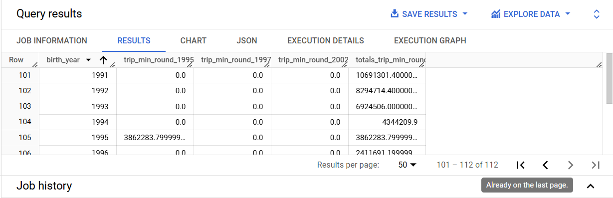
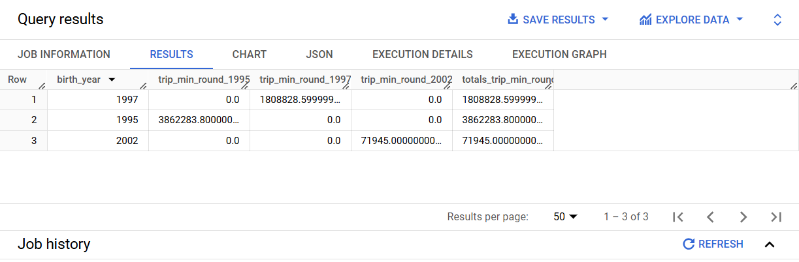
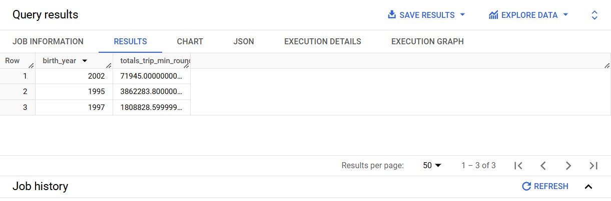
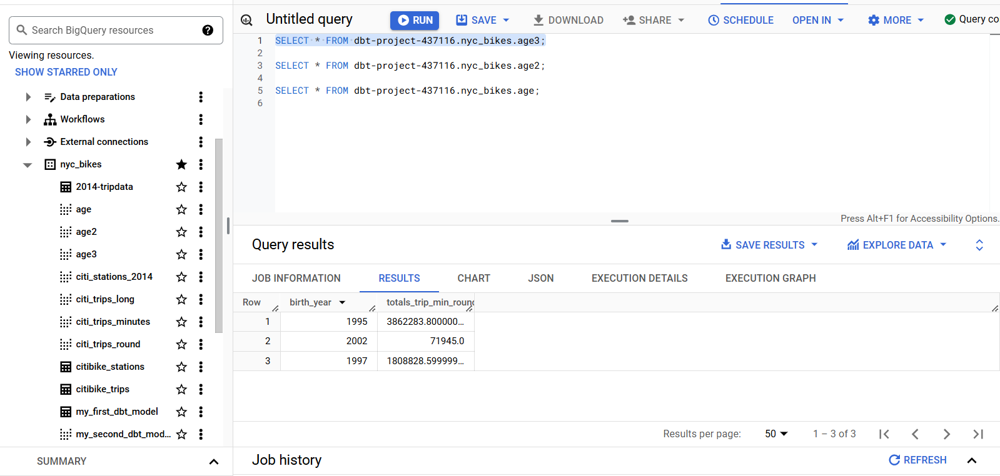
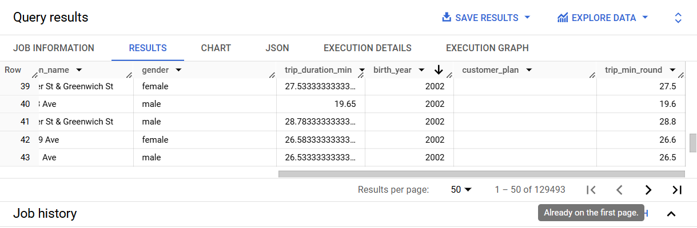

# Jinja

[Jinja](https://docs.getdbt.com/docs/build/jinja-macros) in dbt is used to perform functions that regular SQL is unable to do, such as iterating over columns using a `for` loop and also `if` statements. Jinja is also used to hold environment variables which can be (re)used all over your project. A simple example of jinja use in dbt is when calling the `ref()` function. If you see anything with double curly brackets (`{{ }}`) or with brackets and percentage sign(s) in them (``) then you are dealing with jinja.  

Let's start by explaining some jinja concepts.

- **Expressions {{ ... }}**: Expressions are used when you want to output a string. You can use expressions to reference variables and call macros.

- **Statements **: Statements don't output a string. They are used for control flow, for example, to set up *for* loops and *if* statements, to set or modify variables, or to define macros.

- **Comments {# ... #}**: Jinja comments are used to prevent the text within the comment from executing or outputing a string. 


Let's start with explaining a *for* loop. This is the skeleton of a `for` loop in jinja.

```

-- SQL Code for {{ item }}


```


## A simple jinja statement

Going by the above cue, let's create a jinja statement that will select all those rows whose bike riders' birth years are any of the following: 1995, 1997 and 2002. Nothing special about these years, just that they stem from the unprofitable notion that they correspond to my birth year and those of my siblings!

Create a new folder called `jinja` under the `models` directory and within it create a `years` SQL file. Copy paste the following contents into `years.sql`.

```



SELECT * 
FROM {{ ref('citi_trips_long') }}
WHERE birth_year = {{ year }}



```

Let's go through the above line by line.

* `` - this sets the variables we will use to extract some data from our tables. The `years` variable consists the years that we will use to filter our tables. 


* `` - the SQL statement that will be repeated is placed inside the `for ...` loop. In this statement, for every year in the `years` variable list, we will repeat the below sql statement, where `{{ year }}` is each year in the `years` variable:

```
SELECT * 
FROM {{ ref('citi_trips_long') }}
WHERE birth_year = {{ year }}

```

* `` - nothing more than marking the end of the for loop. 

Now, if we run the code `dbt compile --select jinja`, you will see a new `years.sql` appear under the `target/compiled/dbt_book/models/jinja/` directory. 


Here is how the code looks like:

```
SELECT * 
FROM `dbt-project-437116`.`nyc_bikes`.`citi_trips_long`
WHERE birth_year = 1995


SELECT * 
FROM `dbt-project-437116`.`nyc_bikes`.`citi_trips_long`
WHERE birth_year = 1997


SELECT * 
FROM `dbt-project-437116`.`nyc_bikes`.`citi_trips_long`
WHERE birth_year = 2002

```


What the `for` loop did was to avoid the redundancy of selecting each `birth_year` in its own `SELECT` statement. Instead it put the three `SELECT` statements inside one `for` loop statement. Going a step further, also the redundancy of hardcoding the `year` is removed. This formula, though a bit complicated, toes in line with the Do not Repeat Yourself (DRY) principle in programming.

## A more complex jinja query 


One can also create more complex jinja queries that leverage other SQL functionalities such as aggregation and CASE WHEN statements. Now suppose, for purely selfish reasons, this author wants to compare the bike ride durations against those of other people who were born in the years 1995, 1997 and 2002. Below is an `age.sql` file that creates a table that has a column showing the trip duration for each value in the `years` variable.

```


SELECT birth_year, 

SUM (CASE WHEN birth_year = {{ year }} THEN trip_min_round ELSE 0 END) AS trip_min_round_{{ year }},

SUM(trip_min_round) AS totals_trip_min_round
FROM {{ ref('citi_trips_long') }}
GROUP BY birth_year

```

In the corresponding `age.sql` in the `target` directory, this is the compiled SQL query result.

```
SELECT birth_year, 

SUM(CASE WHEN birth_year = 1995 THEN trip_min_round ELSE 0 END) AS trip_min_round_1995,

SUM(CASE WHEN birth_year = 1997 THEN trip_min_round ELSE 0 END) AS trip_min_round_1997,

SUM(CASE WHEN birth_year = 2002 THEN trip_min_round ELSE 0 END) AS trip_min_round_2002,

SUM(trip_min_round) AS totals_trip_min_round
FROM `dbt-project-437116`.`nyc_bikes`.`citi_trips_long`
WHERE birth_year IN (
  
  
    1995, 
  
  
    1997, 
  
  
    2002
  
)
GROUP BY birth_year
```

Pasting this query in BigQuery gives us the below table:




We can see a column for trip duration in minutes for each of the three select years of 1995, 1997 and 2002. However, other years not set in our `years` variable are included as well, but with the value `0` in each of the three columns. Before one starts getting confused and blaming the universe for not wanting us to succeed, there is a way we can sort this pesky issue: enter the `if not loop.last` statement!

In our previous SQL query, you saw that one can sort the issue of excluding unnecessary years using the `WHERE` clause. For example, we would have used the clause `WHERE birth_year IN (1995, 1997, 2002)`. However, we frowned on this approach because it is breaking the DRY principle by hardcoding the years by hand. Taking a more complex approach to fulfil the DRY principle sounds like we are exhibiting Obsessive Compulsive Disorder (OCD) but being obsessed in doing things in a higher way is not all too bad in programming. 


The [`if not loop.last` statement](https://docs.y42.com/docs/how-to-use-jinja) separates the values of interest with a comma, thus effectively fulfilling the work the `WHERE` clause where it failed. The `age2.sql` shows this in action.

```


SELECT birth_year, 

SUM(CASE WHEN birth_year = {{ year }} THEN trip_min_round ELSE 0 END) AS trip_min_round_{{ year }},

SUM(trip_min_round) AS totals_trip_min_round
FROM {{ ref('citi_trips_long') }}
WHERE birth_year IN (
  
  {# this will separate the years 1995, 1997 and 2002 with a comma, nothing out of this world #}
    {{ year }}, 
  
)
GROUP BY birth_year
```

Running the `dbt compile --select jinja` code will compile the `age2.sql` inside the `target` directory. It's contents are as follows. Notice the effect of the `if not loop.last` statement at the end and how it is a replicate of hardcoding `WHERE birth_year IN (1995, 1997, 2002)`.

```
SELECT birth_year, 

SUM(CASE WHEN birth_year = 1995 THEN trip_min_round ELSE 0 END) AS trip_min_round_1995,

SUM(CASE WHEN birth_year = 1997 THEN trip_min_round ELSE 0 END) AS trip_min_round_1997,

SUM(CASE WHEN birth_year = 2002 THEN trip_min_round ELSE 0 END) AS trip_min_round_2002,

SUM(trip_min_round) AS totals_trip_min_round
FROM `dbt-project-437116`.`nyc_bikes`.`citi_trips_long`
WHERE birth_year IN (
  
  
    1995, 
  
  
    1997, 
  
  
    2002
  
)
GROUP BY birth_year
```

Copy pasting the above compiled SQL into BigQuery you get a cleaner table with all the other birth years left out.



## Improvising using DRY Principle

We can go a step further and make our table leaner, by eliminating all the `trip_min_round_<year>` columns and having just one `trip_min_round` summation column for the three years 1995, 1997 and 2002. The `ages3.sql` exemplifies this.

```


SELECT birth_year, 
SUM(trip_min_round) AS totals_trip_min_round
FROM {{ ref('citi_trips_long') }}
WHERE birth_year IN (
  
  {# this will separate the years 1995, 1997 and 2002 with a comma, nothing out of this world #}
    {{ year }}, 
  
)
GROUP BY birth_year
```

After running `dbt compile --select jinja`, the compiled `age3.sql` in the target directory is as follows:

```
SELECT birth_year, 
SUM(trip_min_round) AS totals_trip_min_round
FROM `dbt-project-437116`.`nyc_bikes`.`citi_trips_long`
WHERE birth_year IN (
  
  
    1995, 
  
  
    1997, 
  
  
    2002
  
)
GROUP BY birth_year
```

For sure you get a leaner table which is far less verbose.





One more thing, you can create views from the SQL jinja queries by simply running the trusty `dbt run --select jinja`. This is the resulting output.

```

--snip--
10:37:54  1 of 4 START sql view model nyc_bikes.age ...................................... [RUN]
10:37:59  1 of 4 OK created sql view model nyc_bikes.age ................................. [CREATE VIEW (0 processed) in 4.98s]
10:37:59  2 of 4 START sql view model nyc_bikes.age2 ..................................... [RUN]
10:38:04  2 of 4 OK created sql view model nyc_bikes.age2 ................................ [CREATE VIEW (0 processed) in 4.26s]
10:38:04  3 of 4 START sql view model nyc_bikes.age3 ..................................... [RUN]
10:38:06  3 of 4 OK created sql view model nyc_bikes.age3 ................................ [CREATE VIEW (0 processed) in 2.77s]
10:38:06  4 of 4 START sql view model nyc_bikes.years .................................... [RUN]
10:38:09  BigQuery adapter: https://console.cloud.google.com/bigquery?project=dbt-project-437116&j=bq:africa-south1:ed8f842b-8077-418b-8222-f5e4cb9438d3&page=queryresults
10:38:09  4 of 4 ERROR creating sql view model nyc_bikes.years ........................... [ERROR in 2.78s]
10:38:09  
10:38:09  Finished running 4 view models in 0 hours 0 minutes and 23.66 seconds (23.66s).
10:38:09  
10:38:09  Completed with 1 error and 0 warnings:
10:38:09  
10:38:09    Database Error in model years (models/jinja/years.sql)
  Syntax error: Expected end of input but got keyword SELECT at [15:1]
  compiled code at target/run/dbt_book/models/jinja/years.sql
  
--snip--
```

The same views can be called out in BigQuery like the `age3` view shown below.



Now that the `` and its closing `` statements have ceased being cryptic, we can now sort out why the `years` view could not be created as seen in this `dbt run --select jinja` error.

```
10:38:09  4 of 4 ERROR creating sql view model nyc_bikes.years ........................... [ERROR in 2.78s]
```

If you look at the compiled SQL for the `years.sql` in the target directory, there are multiple SELECT statements each for a single year in the `years` variable. All those three SELECT statements cannot be run simoultaneously to produce a single table in BigQuery. But tweaking the `jinja/years.sql` a bit and using the `loop.last` statement will make all the difference. Here is the `jinja/years2.sql`. 


```




SELECT * 
FROM {{ ref('citi_trips_long') }}

WHERE birth_year IN (
    
    
    {{ year }}
    ,
    

)
```

The `for` loop begins when we want to specify the years, the `if not loop` programmatically adds a comma until the last one and finally the `endfor` statement tells our computer to break out of the looping. Here is the corresponding compiled SQL in the `years2.sql` in the target directory. When this query is pasted, into BigQuery, it only filters the rows matching to the specified birth years.

```
SELECT * 
FROM `dbt-project-437116`.`nyc_bikes`.`citi_trips_long`

WHERE birth_year IN (
    
    
    1995
    ,
    
    
    1997
    ,
    
    
    2002
    
    

)
```



When we run `dbt run --select jinja`, this time round the `years2` view is created. 


```
--snip--
11:45:10  5 of 5 START sql view model nyc_bikes.years2 ................................... [RUN]
11:45:12  5 of 5 OK created sql view model nyc_bikes.years2 .............................. [CREATE VIEW (0 processed) in 2.29s]
--snip--
```


