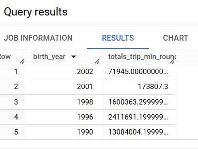
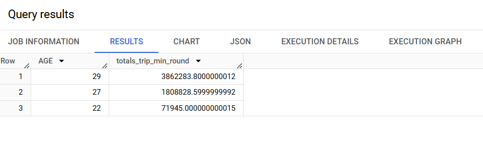
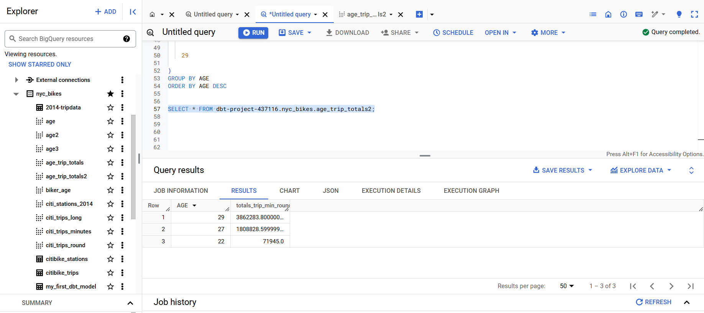

# Macros

A [macro](https://www.phdata.io/blog/what-are-dbt-macros/?utm_source=pocket_saves) in dbt is a reusable piece of code. That's it. A macro in dbt is what a function is to Python or JavaScript. The building block of a macro is the jinja template. Below is the structure of a dbt macro.

```


    SQL logic here, using the parameters as needed.



```

You begin a macro with the name `macro` and end it with `endmacro`. Macros are defined in SQL files and stored inside the already shipped `macros` folder in dbt. 


## Invoking a macro

There are three ways to call a macro. They are:

1. Using expression blocks

2. Call blocks

3. Run operation command 

### Invoking a macro using expression blocks

If the macro does not have any parameters, it can be invoked as a solo object like so:

```
{{ macro_name() }}

```

But if it has parameters, we have to call it with it's entire entourage.

```
{{ macro_name(arg1, arg2, argN) }}

```

### Invoke a macro using call blocks

In this method, one can invoke a macro inside another macro. Here is the template.

```


    Code to be accessed by the macro called_macro



```


The above code calls a macro called `called_macro` and everything in between the `{ %call% }` and `` statements can be accessed using the `caller()` method. 


Here is an example of a macro.

```


    SELECT *
    FROM {{ table_name }}
    WHERE {{ caller() }}



```

Now, call the macro using call blocks.

```


CREATE_DATE >= '2020-02-18'::DATE



```

When it is called it would render:

```
SELECT *
FROM EVENT_TABLE
WHERE CREATE_DATE >= '2020-02-18'::DATE
```

### Invoke a macro from the Command Line Interface (CLI)

To run a macro from the CLI or terminal, we use the `dbt run-operation {macro} --args '{args}'{macro}:` command. The macro will run with the arguments provided. The below macro being run from the CLI selects all columns from a table called `my_table`.

```
dbt run-operation select_all_columns --args '{table_name: my_table}'

```

The above are ways to invoke a macro but for simplicity purposes, we shall rely on the first method of invoking macros using expressions.


## Simple macro

Having known that a macro acts like a function, let's create a macro that calculates the age of a bike rider. We already have the `birth_year` column, so calculating one's age should be as simple as subtracting their birth year from the current year. 


As earlier mentioned, macros should go into the `macros` folder. Create a  `calculate_age` SQL file and inside it paste the following contents.

```


(EXTRACT( YEAR FROM CURRENT_DATE() ) - {{ year }}) 


```

Remember, a macro is a function and thus what goes within the `` and `` expressions is the function itself! This explains why our `calculate_age` macro is so succinct. The `(EXTRACT( YEAR FROM CURRENT_DATE() ) - {{ year }})` is just SQL's way of extracting the current year and subtracting an earlier year being referenced by the variable `{{ year }}`. Of course the specified `{{ year }}` column has to be numeric. 

Alright. To see the `calculate_age` macro in action, create a `biker_age` SQL file inside the `jinja` directory. Paste the following content.

```
SELECT *, 
{{ calculate_age("birth_year")}} AS AGE
FROM 
{{ ref('citi_trips_long') }}

```

In the sub-chapter of [Invoking a Macro](##Invoking a macro), we saw that a macro is invoked in the following format: `{{ macro_name(arg1, arg2, argN) }}`. The macro name goes first, followed by the arguments in brackets. We have essentially done this in the `biker_age` SQL file. The `calculate_age()` macro has been provided the column to calculate on; the `birth_year` column. We use the `AS` keyword to create a new column with the alias `AGE`. Thereafter, we run the open sesame command `dbt compile --select macros`. 


After compilation, dbt created a `biker_age` SQL file containing the below code:

```
SELECT *, 


(EXTRACT( YEAR FROM CURRENT_DATE() ) - birth_year) 

 AS AGE
FROM 
`dbt-project-437116`.`nyc_bikes`.`citi_trips_long`

```

The above should definitely result in a table with the `AGE` column at the far end. 

## Complex macro

The above was a simple macro that neatly drove the point home. How about a more complex macro, like one that works on an entire table, transforms it, has more than one argument and oh my... one in which you can specify the parameters? We want to write our functions on sand, not stone, so that we can change at will. That's the kind of macro we need. 


Let's go. Create a SQL called `age_trips` with the following code:

```


SELECT {{ column }}, 
SUM({{ duration }}) AS totals_trip_min_round
FROM {{ ref( table_name ) }}
WHERE {{ column }} IN (
  
  {# this will separate the years 1995, 1997 and 2002 with a comma, nothing out of this world #}
    {{ year }}, 
  
)
GROUP BY {{ column }}
ORDER BY {{ column }} DESC


```

Our intelligent mind (no pun intended) created a macro that selects a column, sums the time duration in that column and additionally, aggregates the sum based on certain numerical column values. It will not sum everything in the entire set but just certain values specified by the `years` variable. Additionally, we have preset the values to go into the `years` variables which are `1995`, `1997` and `2002`. Finally, we order the table by arranging the values of the specified columns in descending order. 

Now is time to test our macro. Under the `jinja` directory, create a SQL file called `age_trip_totals`. It should have the below minutiae code.

```
{{ age_trips(column='birth_year', duration='trip_min_round',
table_name='citi_trips_long', years = [1990, 1996, 1998, 2001, 2002]) }}
```

What on earth just happened here? There was no `SELECT` statement as in the `biker_age` file? Yes, there wasn't, and for a good reason. We had already specifed our `SELECT` blueprint in the macros file. Therefore, calling the `age_trips` function from within `age_trips_totals` file will invoke the SQL statement encapsulated by the `age_trips` function. If you run `dbt compile --select macros`, the following SQL file will be compiled in the target directory.

```
SELECT birth_year, 
SUM(trip_min_round) AS totals_trip_min_round
FROM `dbt-project-437116`.`nyc_bikes`.`citi_trips_long`
WHERE birth_year IN (
  
  
    1990, 
  
  
    1996, 
  
  
    1998, 
  
  
    2001, 
  
  
    2002
  
)
GROUP BY birth_year
ORDER BY birth_year DESC

```

Pasting this query on BigQuery will give us a table which aggregates the total trip duration for bikers born in specific years only. That is, those bikers born in any of the following years: 1990, 1996, 1998, 2001 and 2002.



One can also create a view of this macro model using `dbt run --select age_trip_totals`. A `biker_age` view should appear under the `nyc_bikes` dataset.

By doing the above, we not only created a macros with default parameters, but we could also change them and get valid results. We can do this by tweaking the `years` argument in our `age_trips()` function. As a matter of fact, the `years` parameter doesn't have to take *years* per se, it can actually work with any numerical column. But we just specified the name `years` as a clue. In the `age_trip_totals2` SQL file, we specified the ages of interest from within the `AGE` column of our `biker_age` view. 

```
{{ age_trips(column='AGE', duration='trip_min_round',
table_name='biker_age', years = [22, 27, 29]) }}
```

Now let's compile this model and see the result:

```
dbt compile --select age_trip_totals2
```

We get the following output in our terminal and by extension, the `age_trip_totals2` SQL file under the `target` directory.

```
19:53:44  Concurrency: 1 threads (target='dev')
19:53:44  
19:53:44  Compiled node 'age_trip_totals2' is:


SELECT AGE, 
SUM(trip_min_round) AS totals_trip_min_round
FROM `dbt-project-437116`.`nyc_bikes`.`biker_age`
WHERE AGE IN (
  
  
    22, 
  
  
    27, 
  
  
    29
  
)
GROUP BY AGE
ORDER BY AGE DESC

```

Pasting the above in BigQuery gives us an aggregation of the total trip duration for people aged 29, 27 and 22. 



As mentioned earlier, and as shown with a quick example of `age_trip_totals` model, we can create views of each of our macro models. Since they are all within the jinja directory, the following does the trick: `dbt run --select jinja`. This should create a view of each of our models created in this chapter.

Below is a snippet of the creation of views.

```
-- snip --
20:15:05  8 of 8 START sql view model nyc_bikes.age_trip_totals2 ......................... [RUN]
20:15:07  8 of 8 OK created sql view model nyc_bikes.age_trip_totals2 .................... [CREATE VIEW (0 processed) in 2.28s]
-- snip --
```




