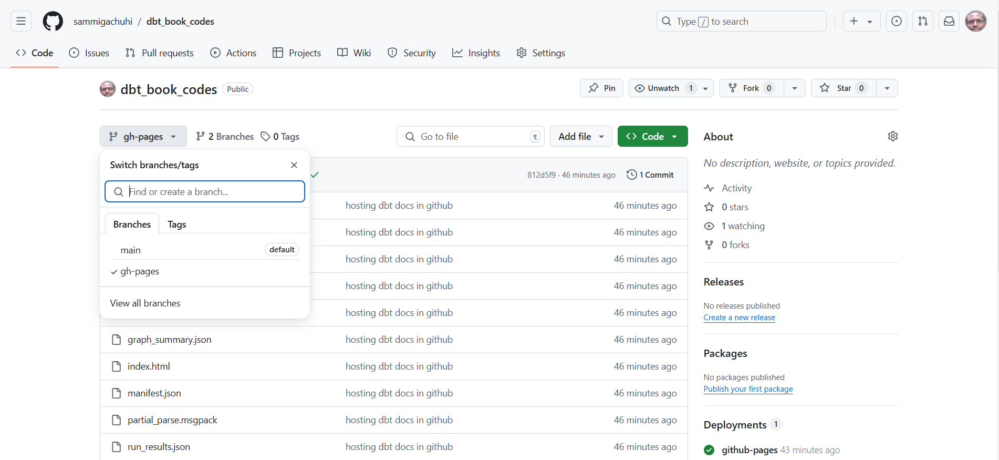
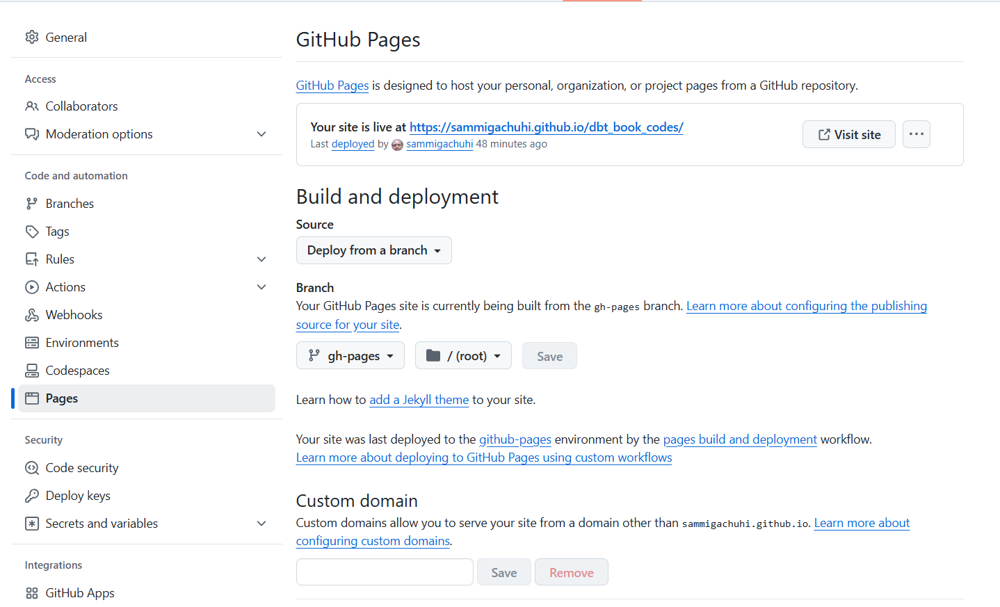

# Hosting dbt generated documentation

Imagine you have put blood, sweat and tears into your book, you have said everything you wanted to say, divulged what was considered secret, and unearthed what was incomprehensible. Except for one thing: you can't publish it. That would be a disaster, a mockery of your efforts, yet that would be our portion if we had not published the dbt documentation we had created in [Chapter 7][Documentation]. After all is said and done, it has to be displayed somewhere, and obviously the world wide web is our playground. 

There are various ways to publish your dbt generated documentation, such as in Github, Google Cloud and Azure Devops. We would have loved to host our dbt generated documentation in Google cloud as that would have put us in the league of astute developers, but the process and costs were a bit too much. Therefore, we slid back to [Github](https://medium.com/dbt-local-taiwan/host-dbt-documentation-site-with-github-pages-in-5-minutes-7b80e8b62feb) which is totally free. 


## Preparations

### Creating a `gh-pages` branch

If hosting dbt documentation were easy, then we would have simply done so from the `main` branch. However, taking into account the process of hosting on a more sophisticated platform such as Google Cloud, the entire process seems like a thing for the top-tier tech gurus. It is for this reason we create a separate branch by the name of `gh-pages`. Github can autodetect the `index.html` file under this branch automatically compared to a branch by any other name.

To create a new branch run `git checkout --orphan gh-pages`.

The purpose of the `--orphan` command is to create a branch from a clean slate; it has no connection to previous commits. 


### Tracking the `target` folder 

Now, in order to create the dependency files for your dbt documentation within the `target` folder, run `dbt docs generate`.

Once the `catalog.json` is rewritten, we must add this branch for tracking. By default, in the `.gitignore` file, all files under the `target` folder are set to not be tracked. Therefore, when adding this folder, we introduce the `-f` keyword when preparing our files for commit like so:

```
git add -f target
```

Now let's commit our `target` folder contents within our local `gh-pages` branch.

```
git commit -m 'hosting dbt docs in github' target
```

Our terminal did get a huge list of outputs!

### Pushing to Github

Next, we only want to take the contents of our `target` folder and push them into the `gh_pages` branch. We use the following code: `git subtree push --prefix target origin gh-pages`. A subtree is like a sub-folder in Github. We use `subtree` when we want to save certain directories from one repository into another. In our case we only want the contents of the `target` folder and this we specified using the `--prefix` keyword. Sometimes, one could have been saving their work at a higher folder level, such as yours truly. What do we mean here? We mean that perhaps you have been commiting from `folder1/myfiles/commit-here` but you work was initialized by git from within `folder1`. In this case just push your files from `folder1` or else you will get the below error when performing a subtree push:

```
You need to run this command from the toplevel of the working tree.
```

In this case, just specify the top-level folder and the target folder, separated with slash(es) like so: 

```
git subtree push --prefix dbt_book/target origin gh-pages
```

Once you receive a message that the push operation was successful, you can checkout to the main branch like so: `git checkout main` or for any other branch for that matter. 

## Hosting on Github

If you go to your specific repository on Github, such as `dbt_book_codes` in our case, you can use the dropdown right under the repository name to move into a different branch. 



Once you are within the `gh-pages` branch, go to the **Settings** tab, and click on the **Pages** menu. You will find that Github already auto-detected the `index.html` file and proceeded to create a hosted webpage going by the name of your repository.



Click on the link to go to your hosted dbt documentation. Access the dbt generated documentation for this course from [here](https://sammigachuhi.github.io/dbt_book_codes/#!/overview).


